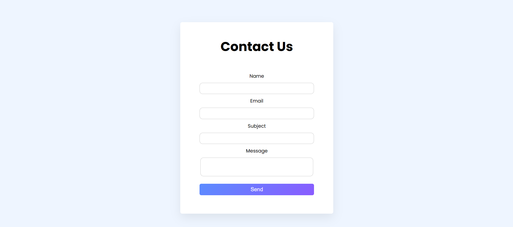

<h1 align="center"> Modern Contact Form</h1>

  <b>A clean, responsive, and modern contact form UI built with HTML & CSS & JS with validation</b> 
  🌐 <a href="https://sajjadr17.github.io/contact-form/">View Live Demo</a> • 💾 <a href="https://github.com/SajjadR17/contact-form">View on GitHub</a>

---

### 🎨 Preview

  

---

## 🧠 About The Project

This project is a responsive Contact Form created to practice and showcase front-end development skills.  
It features a soft card design with box-shadow, a blue-purple gradient button, validations, and a minimal UI for modern websites.

---

## ⚙️ Tech Stack

| Language       | Purpose          |
| :------------- | :--------------- |
| HTML5          | Structure        |
| CSS3 (Flexbox) | Styling & Layout |
| JS             | Validation       |

---

## 🌟 Features

✅ Fully responsive design (mobile-first)  
✅ Gradient “Send” button (Blue → Purple)  
✅ Clean spacing and typography  
✅ Soft shadows for depth  
✅ Hover and focus animations  
✅ Accessible labels and placeholders
✅ Inputs Validations

---

## 🚀 Deployment

Deployed with Netlify in one click ⚡  
🔗 [View Live Demo](https://sajjadr17.github.io/contact-form/)

---

## 🧭 How To Run Locally

`bash
git clone https://github.com/SajjadR17/contact-form.git
cd contact-form
code .

---

## 🧾 License

This project is licensed under the MIT License — meaning you're free to use, modify, and share it,  
as long as you give proper credit to Sajjad Roohandeh.
